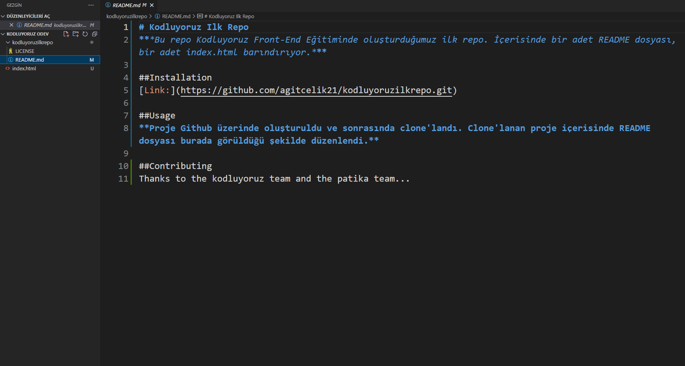

# Kodluyoruz Ilk Repo
***Bu repo Kodluyoruz Front-End Eğitiminde oluşturduğumuz ilk repo. İçerisinde bir adet README dosyası, bir adet index.html barındırıyor.***



## Installation
```https://github.com/agitcelik21/kodluyoruzilkrepo.git```

## Usage
**Proje Github üzerinde oluşturuldu ve sonrasında clone'landı. Clone'lanan proje içerisinde README dosyası burada görüldüğü şekilde düzenlendi.**

## Contributing
Thanks to the kodluyoruz team and the patika team...

## License
[MIT](https://choosealicense.com/licenses/mit/)

## Academy
***[patika](www.patika.dev)***